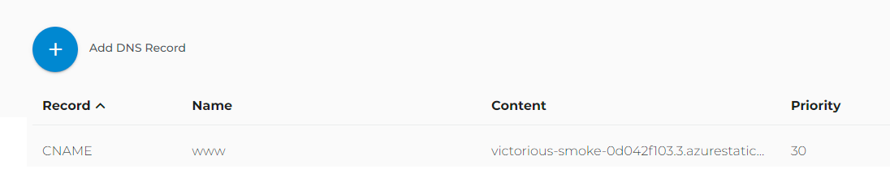

# Using AI Extensions for VS Code

* Create a static web site paying only for the storage account on Azure.
* Using GitHub Actions to build the pipeline
* Using GitHub as git repository

## Custom Domain Configuration

1. Domain validation 

```txt
https://www.skyui.space 
```

Using the registrar Domain.com 
Advanced -> Going to DNS & Nameservers -> and then adding a record. 
 CNAME added based on the Azure reference.


# Build Infra using Terraform for a Blue-green deployment of a demo APP on AKS cluster on Azure 
